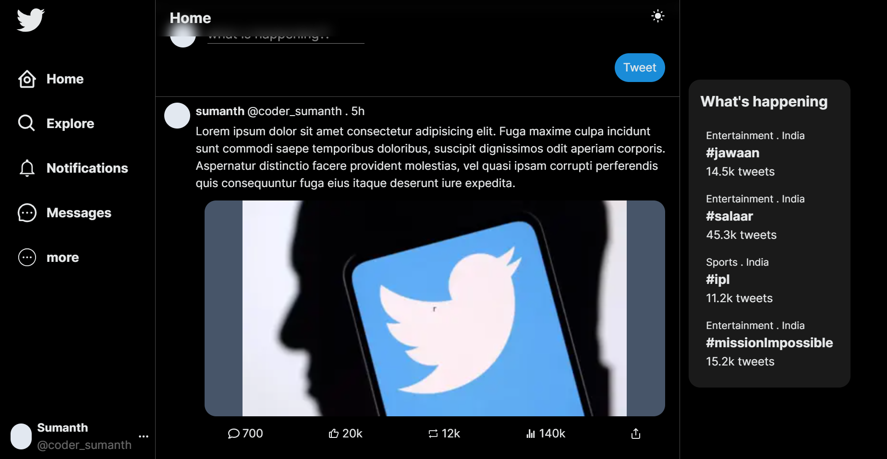
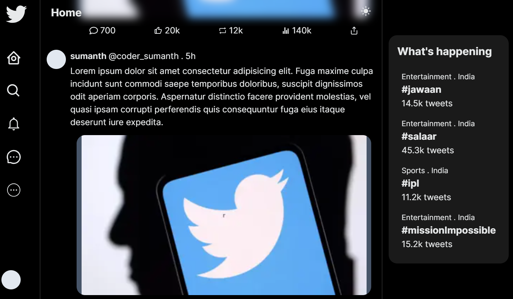
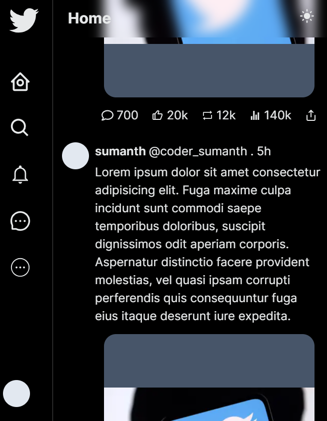
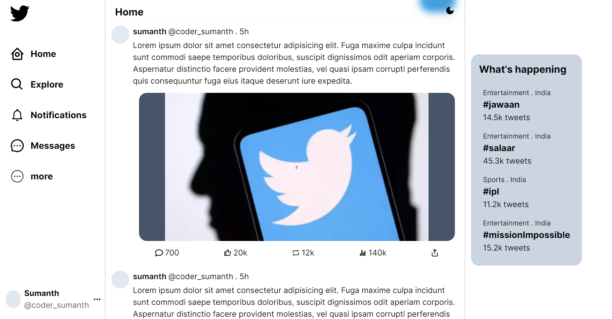
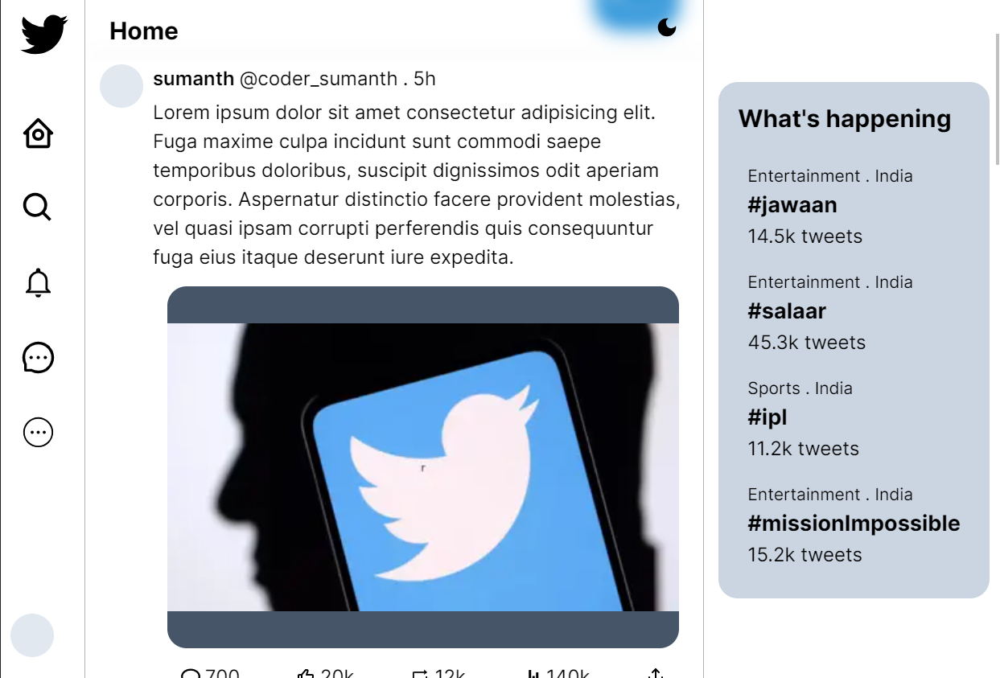
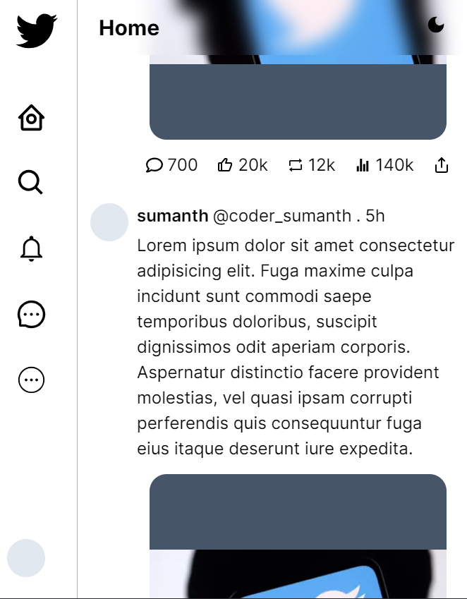

## Overview
This is twitter clone built using [Next.js](https://nextjs.org/) 13.4

Features: | <p></p>
--------- | --------
 |✅ dark and light mode 
 |✅ Responsive design
 |✅ NextJs latest App router
 |✅ complete typescript
 |
<div style='display:flex; gap:10px'>



</div>
<div style='display:flex; gap:10px; margin-top:20px'>



</div>
  
 
  


## Getting Started

This is a [Next.js](https://nextjs.org/) project bootstrapped with [`create-next-app`](https://github.com/vercel/next.js/tree/canary/packages/create-next-app).

install the node packages:
```bash
npm install
# or
yarn install
#or
pnpm install
```

run the development server:

```bash
npm run dev
# or
yarn dev
# or
pnpm dev
```


## Learn More

To learn more about Next.js, take a look at the following resources:

- [Next.js Documentation](https://nextjs.org/docs) - learn about Next.js features and API.
- [Learn Next.js](https://nextjs.org/learn) - an interactive Next.js tutorial.

You can check out [the Next.js GitHub repository](https://github.com/vercel/next.js/) - your feedback and contributions are welcome!
